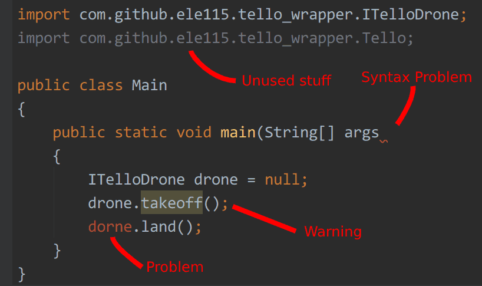

# My code is not working

IntelliJ IDEA is your best friend.
Before you reach out to TAs, it may have already figured out what's going wrong in your code and given you some error hints:

1. If you see **red wavy underline**, then there is a **syntax problem** such as missing/extra semicolon or braces.
1. If you see anything **red**, then there is a **problem** such as you used a variable without declaration.
1. If you see anything with **yellow background**, then there is a **warning** indicating that you **MAY** encounter some issue when your code runs.
1. If you see anything **gray**, then you may have written something you don't need.

To the right of your code editor window, you may also notice a thin column of colorful dashes (not shown in the screen above).
These are the summary of all error hints.
Hover on it to read what's going wrong.
Click on it to locate the exact location of the anticipated error.

# Still not working?

Some common mistakes:

* `A problem occurred evaluating settings`

You didn't modify `settings.gradle`.

* `Error: Could not find or load main class com.github.ele115.xxx`

Make sure the `mainClassName` in `build.gradle` matches your class name.

# Where to find the documentation of the drone

1. [Drone Methods Cheat sheet](https://github.com/ELE115/docs/blob/master/Drone_Methods_Cheat_Sheet.md)
1. To quickly show simple documentation of a particular method or class (such as `ITelloDrone`, or `Tello.Connect`),
click it and hit `Ctrl+Q` (or `Command+Q` if using macOS).
1. To open the source code of something, hold `Ctrl` (or `Command if using macOS) and click on the stuff you want to look at.

**Note:** Don't be intimidated about these. Feel free to ask TAs if you don't understand what's inside.

# How to maintain a good coding style

A piece of code is valid as long as it has correct syntax and semantics.
But code with bad style hurts our feelings and, with time, may lead to incorrect syntax and semantics.
Bad style *may* also hurt your grade.

In ELE115 world, there is a large set (238) of rules that defines *what is a good coding style*.
Refer to your `.editorconfig` file for the complete specification of ELE115 coding styles. (Please don't modify the file!)

Since we take coding style serisouly, we provde a way to automatically **check** your code against the rules and **fix** all violations.
This process is called `auto-format`.
We encourage you to auto-format your code frequently, and
we **strongly** encourage you to auto-format your code **before** commit and push.

To auto-format your code:

In your Java code file,
* For Linux/Windows users, simply hit `Ctrl+Alt+L`.
* For Mac OS users, simply hit `Option+Command+L`.

**Note:** If you don't see any changes,
you are already doing great in coding style!
No rule violations detected.
